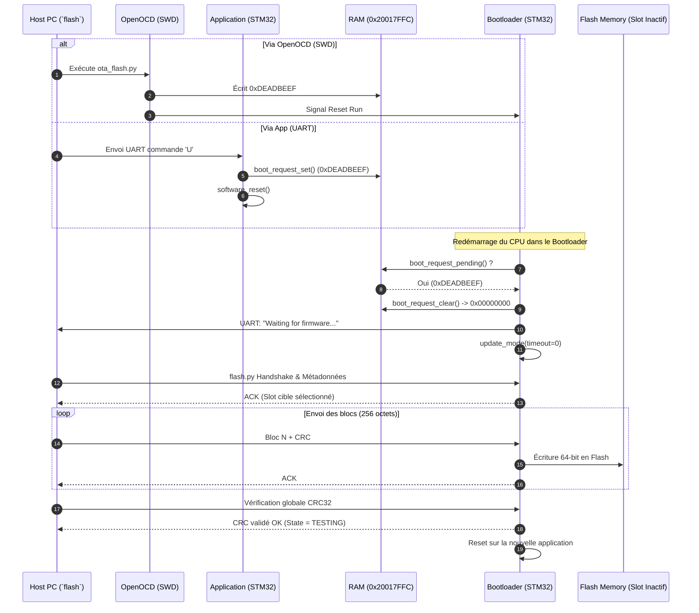

# Documentation Technique Complète : Système de Mise à Jour OTA Automatisé

Ce document décrit en détail l'ensemble des modifications, ajouts et choix d'architecture intégrés pour permettre la mise à jour logicielle (OTA) automatique et sans intervention physique (sans appui sur le bouton Reset) sur le microcontrôleur **STM32L476RG**.

---

## Table des Matières

1. [Vue d'Ensemble de l'Architecture](#1-vue-densemble-de-larchitecture)
2. [Cartographie Mémoire & Stratégie RAM Flag](#2-cartographie-mémoire--stratégie-ram-flag)
3. [Détail des Fichiers Ajoutés](#3-détail-des-fichiers-ajoutés)
   - [3.1. `shared/boot_request.h`](#31-sharedboot_requesth-nouveau)
   - [3.2. `tools/ota_flash.py`](#32-toolsota_flashpy-nouveau)
4. [Détail des Fichiers Modifiés](#4-détail-des-fichiers-modifiés)
   - [4.1. Linker Scripts (`bootloader/linker.ld`, `app/linker_slotA.ld`, `app/linker_slotB.ld`)](#41-linker-scripts)
   - [4.2. `bootloader/main.c`](#42-bootloadermainc)
   - [4.3. `app/main.c`](#43-appmainc)
5. [Diagramme de Flux et Déroulement Temporel](#5-diagramme-de-flux-et-déroulement-temporel)
6. [Guide d'Utilisation](#6-guide-dutilisation)

---

## 1. Vue d'Ensemble de l'Architecture

### Problématique initiale
Le bootloader original n'ouvrait une fenêtre d'écoute série (2 secondes) qu'immédiatement après un reset matériel. Pour flasher une application, l'utilisateur devait appuyer manuellement sur le bouton **Black/Reset** de la carte Nucleo puis exécuter le script hôte dans un timing serré.

### Solution implémentée
Mise en place d'un mécanisme de **Boot Request Flag** persistant en RAM à travers un Soft Reset (via AIRCR ou OpenOCD/ST-Link) :
1. L'hôte ou l'application active écrit un mot magique (`0xDEADBEEF`) dans une zone réservée tout en haut de la RAM.
2. La cible est réinitialisée par logiciel (Soft Reset).
3. Au démarrage, le Bootloader lit le mot magique, entre immédiatement en **mode mise à jour infini** (sans timeout de 2s) et efface le flag.
4. Le script hôte transfère le binaire via UART (Slot A ou Slot B selon la politique Dual-Bank).
5. La cible redémarre sur la nouvelle version en état `TESTING` puis s'auto-confirme en `VALID`.

```
                    ┌────────────────────────┐
                    │ Host PC (flash / OTA)  │
                    └───────────┬────────────┘
                                │ OpenOCD (SWD) ou UART 'U'
                                ▼
                    ┌────────────────────────┐
                    │ RAM: Write 0xDEADBEEF  │
                    │ @ 0x20017FFC           │
                    └───────────┬────────────┘
                                │ Soft Reset (AIRCR)
                                ▼
                    ┌────────────────────────┐
                    │  Bootloader main()     │
                    │  Détecte le flag       │
                    │  Entre en update_mode  │
                    └───────────┬────────────┘
                                │ Transfert UART (flash.py)
                                ▼
     ┌────────────────────────────────────────────────────────┐
     │ Flash Dual-Bank : Écriture sur le slot inactif (A / B) │
     └────────────────────────────────────────────────────────┘
```

---

## 2. Cartographie Mémoire & Stratégie RAM Flag

### Réservation des 4 derniers octets de la RAM
* **SRAM1** de la STM32L476 : `96 KB` (de `0x20000000` à `0x20018000`).
* **Adresse du flag** : `0x20017FFC` (derniers 4 octets).
* **Initialisation de la pile (Stack Pointer `_estack`)** : déplacée à `0x20017FFC`.

```
0x20018000 ┌───────────────────────────────────────────┐
           │ BOOT_REQUEST_MAGIC (0x20017FFC - 4 octets)│ ◄── Zone réservée
0x20017FFC ├───────────────────────────────────────────┤ ◄── _estack (Sommet de pile)
           │                                           │
           │                                           │ ▲
           │              Pile (Stack)                 │ │ Grandit vers
           │                                           │ │ le bas
           │                                           ▼ │
           ├───────────────────────────────────────────┤
           │               Tas (Heap)                  │
           ├───────────────────────────────────────────┤
           │      Variables (.data & .bss)             │
0x20000000 └───────────────────────────────────────────┘
```

> **Garantie de sécurité :** En définissant `_estack` à `ORIGIN(RAM) + LENGTH(RAM) - 4`, le compilateur et le runtime C n'écrasent **jamais** cette adresse avec la pile ou des variables globales.

---

## 3. Détail des Fichiers Ajoutés

### 3.1. `shared/boot_request.h` [NOUVEAU]
Fichier d'en-tête partagé entre le Bootloader et l'Application.

* **Constantes :**
  ```c
  #define BOOT_REQUEST_ADDR   ((volatile uint32_t *)0x20017FFCUL)
  #define BOOT_REQUEST_MAGIC  0xDEADBEEFUL
  ```
* **Fonctions Inline :**
  - `boot_request_set()` : Écrit `0xDEADBEEF` à `0x20017FFC`.
  - `boot_request_pending()` : Vérifie si le mot magique est présent.
  - `boot_request_clear()` : Remet l'adresse à zéro pour éviter une boucle de mise à jour au prochain redémarrage.

---

### 3.2. `tools/ota_flash.py` [NOUVEAU]
Script d'orchestration global permettant le flash en une seule commande hôte :

* **Fonction `trigger_via_openocd()`** :
  Exécute OpenOCD en ligne de commande pour manipuler directement la cible via ST-Link/SWD :
  ```bash
  openocd -f interface/stlink.cfg -f target/stm32l4x.cfg \
          -c "init; halt; mww 0x20017FFC 0xDEADBEEF; reset run; exit"
  ```
* **Fonction `wait_for_bootloader()`** :
  Surveille brièvement le port `/dev/ttyACM0` pour capturer la bannière `Waiting for firmware...`.
* **Fonction `run_flash()`** :
  Délègue l'envoi des paquets binaires vérifiés par CRC au script de protocole existant `tools/flash.py`.

---

## 4. Détail des Fichiers Modifiés

### 4.1. Linker Scripts
* **Fichiers :**
  - `bootloader/linker.ld`
  - `app/linker_slotA.ld`
  - `app/linker_slotB.ld`
* **Modification :**
  ```diff
  - _estack = ORIGIN(RAM) + LENGTH(RAM);
  + /* Top of RAM minus 4 bytes reserved for the boot request flag */
  + _estack = ORIGIN(RAM) + LENGTH(RAM) - 4;
  ```
* **Rôle :** Aligne tous les binaires (Bootloader et Application) sur la même convention de pile pour empêcher tout écrasement mémoire du flag.

---

### 4.2. `bootloader/main.c`
* **Inclusion :** `#include "boot_request.h"`
* **Modification dans `main()` :**
  ```c
  /* Insertion immédiatement après l'initialisation des périphériques de base */
  crc32_init();
  protocol_init();

  if (boot_request_pending()) {
      boot_request_clear();
      uart_puts("\r\n[BOOTLOADER] OTA request received\r\n");
      uart_puts("Waiting for firmware...\r\n");
      update_mode(0);   /* timeout = 0 -> attente infinie */
      while (1) { }
  }
  ```
* **Rôle :** Si le flag est détecté au boot, on bypasse le démarrage automatique de l'application et on passe immédiatement en mode réception de firmware.

---

### 4.3. `app/main.c`
* **Inclusion :** `#include "boot_request.h"`
* **Ajout du registre RX UART et fonctions utilitaires :**
  ```c
  #define USART2_RDR  (*(volatile uint32_t *)(USART2_BASE + 0x24))

  /* Lecture UART non bloquante */
  static int uart_getc(uint8_t *c)
  {
      if (USART2_ISR & (1U << 5)) {   /* Bit RXNE */
          *c = (uint8_t)(USART2_RDR & 0xFFU);
          return 1;
      }
      return 0;
  }

  /* Reset logiciel du Cortex-M4 via le registre AIRCR */
  static void software_reset(void)
  {
      *(volatile uint32_t *)0xE000ED0CUL = 0x05FA0004UL;
      while (1) { }
  }
  ```
* **Modification dans la boucle principale de l'App :**
  ```c
  /* Si l'hôte envoie la commande 'U' par le port série */
  uint8_t rx;
  if (uart_getc(&rx) && rx == 'U') {
      uart_puts("\r\nOTA request received -- resetting to bootloader\r\n");
      boot_request_set();
      software_reset();
  }
  ```
* **Rôle :** Permet à l'application elle-même de redémarrer en mode bootloader si sollicitée par le canal série applicatif.

---

## 5. Diagramme de Flux et Déroulement Temporel



---

## 6. Guide d'Utilisation

### 1. Flash automatique en une commande
Depuis n'importe quel terminal dans le projet :
```bash
flash
```
*Génère et injecte la version vers le slot libre (Slot A si Slot B actif, ou Slot B si Slot A actif) sans jamais toucher à la carte.*

### 2. Flasher une version spécifique
```bash
flash --version 2.0.0
```

### 3. Gestion du port série en écoute
* Ne pas laisser de terminal série (`minicom`, `screen`, `picocom`) ouvert sur `/dev/ttyACM0` au moment d'exécuter `flash`, car Linux distribue les octets reçus au premier processus qui lit.
* Pour flasher puis observer directement les logs :
```bash
flash && term
```
